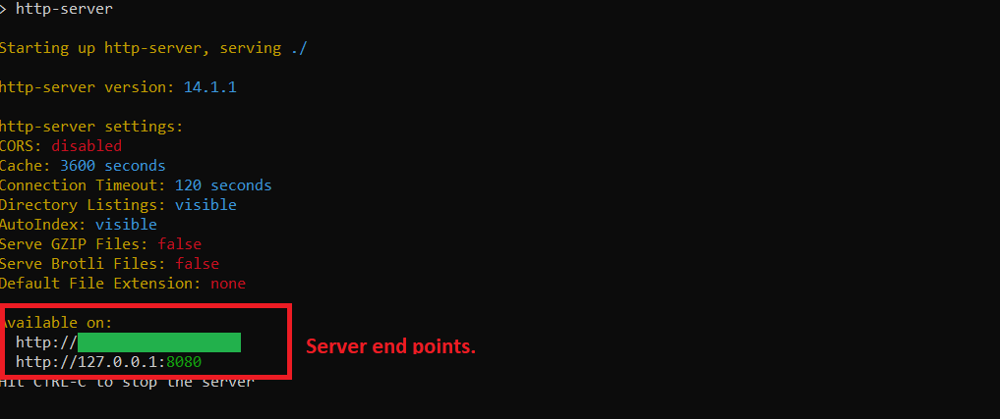

# DnD-Spells-Web-Page
* DnD Spells: Single page website.
* This is a practice portfolio project.
* You can search and get "Dungeons & Dragons" TTRPG spell descriptions. Just contains "Player's Handbook" spells.
* Spells and their descriptions are consumed from the [API](https://www.dnd5eapi.co/) and passes to page.
* A search bar implemented with Trie DS for efficient search operations and auto-completion feature.
## To run this project:
1. Install Node.js: [Node.js](https://nodejs.org/en/download)
2. Clone project folders to your local machine.
3. Open Command Prompt
4. Change directory to project direction.
5. Run this command to install project dependencies: **"npm install"**. (Without quotation marks.) And hit enter until installing ends.
6. Run on of these commands to start server: **"npm start"**  **"npm http-server"**.
7. Run one of the end points on your browser  

